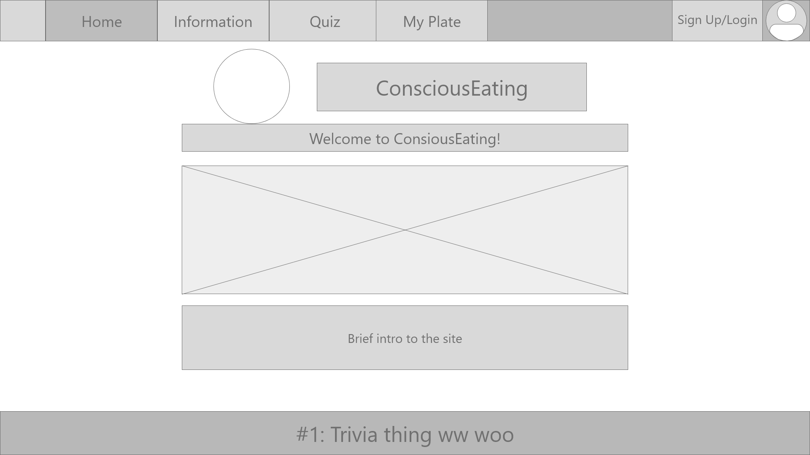
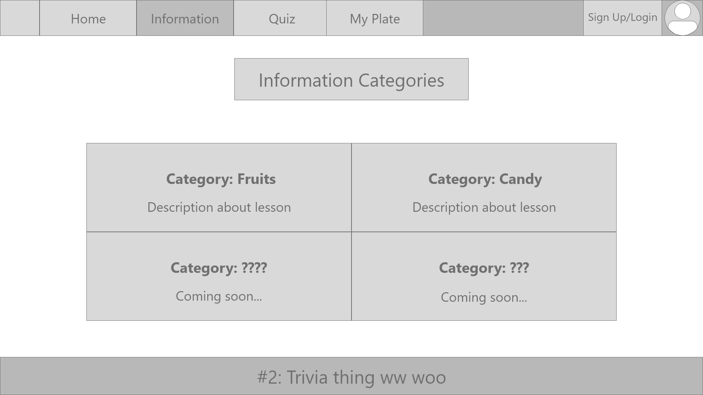
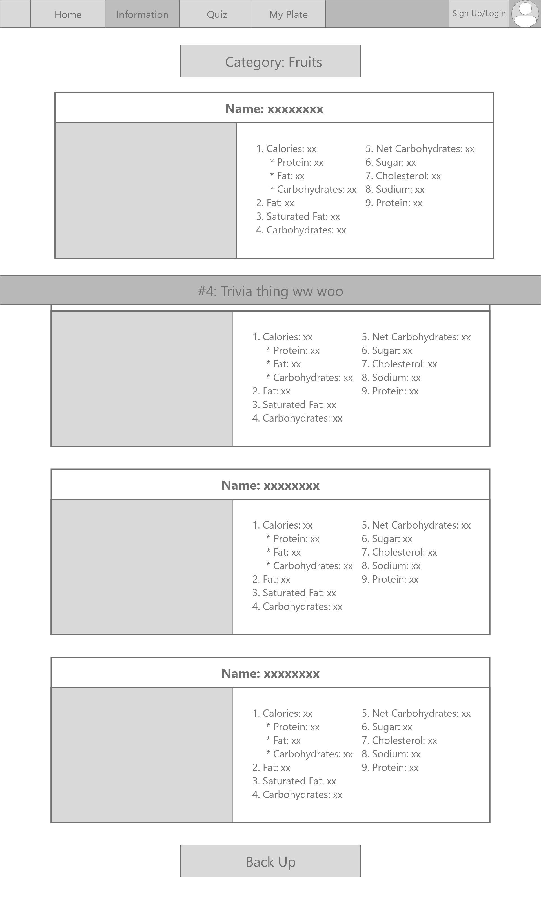
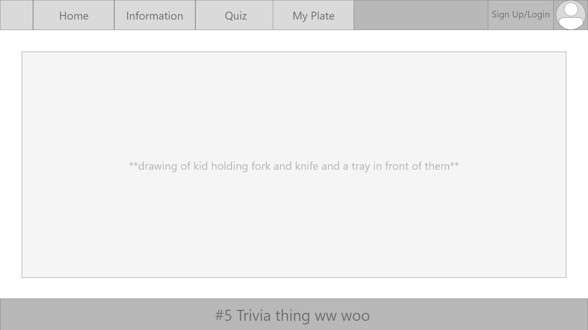
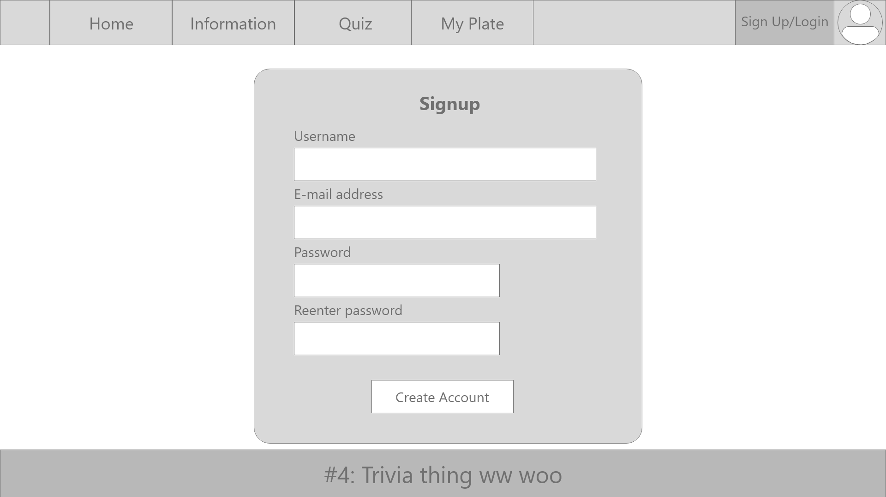

# ConsciousEating [integrated project]

ConsciousEating is an educational site that allows users to learn the nutritional value of the everyday food they eat. This site also challenges users
through quizzes, allowing them to earn incentives when they score full marks for the quizzes.

## Website

[ConsciousEating](https://joliehehehe.github.io/Integrated-Project/) was created to educate users on the nurtritional value of the food that they eat 
on a daily in a fun and engaging way. 
What you will be able to do on this site:

- Learn the nutritional values of everyday food items.
- Do quizzes.
- Receive in-site collectibles through receiving full marks on quizzes.
- Get the chance to participate in the monthly lotteries.

## Features

- Home Page
    - Below the "About Us" section, there is a button for users to click that will link them to a wikipedia page with a table of food nutrients for users who are
    interested to find out more about other food items.
- Information Pages
    - Users are able to click on the categories that are linked to their respective information pages.
    - Users can read the information pages to learn the nutritional value of everyday foods.
- Quiz Pages
    - Users will be able to participate in quizzes. By achieving full marks, users will be given collectibles and get the chance to participate in the monthly lotteries!
- My Plate Page
    - Users are able to view the collectibles they received from the quizzes.
- Countdown Page
    - Users will be able to view a real-time countdown to the results of the monthly lottery

## Technologies Used

### Languages

- *[HTML](https://en.wikipedia.org/wiki/HTML#:~:text=Hypertext%20Markup%20Language%20(HTML)%20is,scripting%20languages%20such%20as%20JavaScript.)*
    -HTML was used to create the skeleton of the whole webpage.
- *[CSS](https://en.wikipedia.org/wiki/CSS)*
    -CSS was used to apply designs to the webpage.
- *[JavaScript](https://www.javascript.com/)*
    -Javascript was used to create the quizzes, collectibles page and information pages.

## Wire Frames

## Testing

### Page Preview

### Task List
| No.  |     Feature     |  Date Tested |
|------|:---------------:|-------------:|
| 1    |  Navigation Bar |    01/02     |
| 2    | Countdown Timer |    01/02     |
| 3    |      Quiz       |    05/02     |
| 4    |                 |              |

## Credits

### Codes (Taken or referenced from)

- Quiz
    - [Quiz template](https://www.sitepoint.com/simple-javascript-quiz/)

### Media

- All digital assets were created by Jolie & Mandy

### Acknowledgements

- I received inspiration for the digital assets from: 
    - Logo
        - [Head](https://dlpng.com/png/1657829)
        - [Cutlery](https://www.shutterstock.com/image-vector/fork-knife-linear-icon-line-editable-790122049)