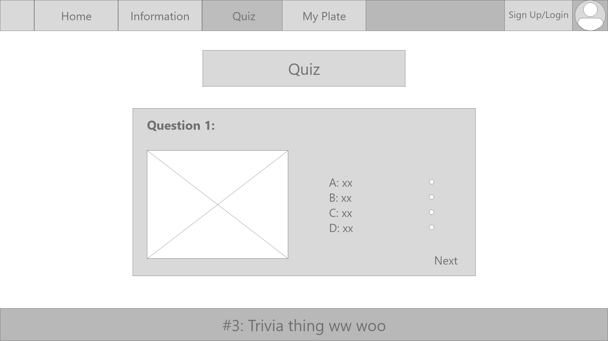
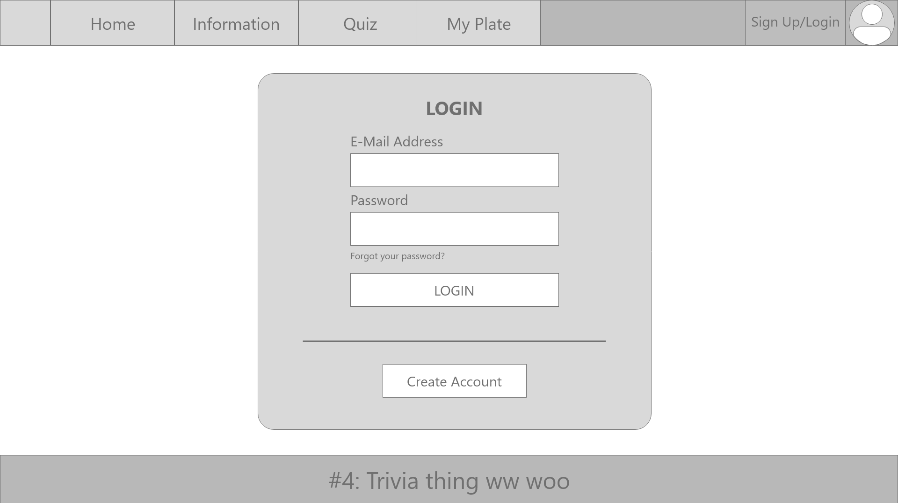

# ConsciousEating [integrated project]

ConsciousEating is an educational site that allows users to learn the nutritional value of the everyday food they eat. This site also challenges users
through quizzes, allowing them to earn incentives when they score full marks for the quizzes.

## Website

[ConsciousEating](https://joliehehehe.github.io/ConsciousEating) was created to educate users on the nurtritional value of the food that they eat 
on a daily in a fun and engaging way. 
What you will be able to do on this site:

- Learn the nutritional values of everyday food items.
- Do quizzes.
- Receive in-site collectibles through receiving full marks on quizzes.
- Get the chance to participate in the monthly lotteries.

## Features

- Home Page
    - Below the "About Us" section, there is a button for users to click that will link them to a wikipedia page with a table of food nutrients for users who are
    interested to find out more about other food items.
- Information Pages
    - Users are able to click on the categories that are linked to their respective information pages.
    - Users can read the information pages to learn the nutritional value of everyday foods.
- Quiz Pages
    - Users will be able to participate in quizzes. By achieving full marks, users will be given collectibles and get the chance to participate in the monthly lotteries!
- My Plate Page
    - Users are able to view the collectibles they received from the quizzes.
- Loading Page
    - User will see a loading animation, auto redirect to countdown page.
- Countdown Page
    - Users will be able to view a real-time countdown to the results of the monthly lottery

## Design Rationale

For our application, we wanted to go with something simple and easy for users to maneuver. Therefore, we used a basic navigation bar at the top of our page. By making it simple and easy for users to use, users will be more inclined to use it. The colours we chose were selected to ease the eyes of users when they use our application. If an application has extremely bright colours, it might chase away potential users because of their preference for more soothing colours.

For the mascots on our home page, both were designed to represent each category in the site, Fruits and Dessert. The one on the left is based on the image of a strawberry since fruits is one of the categories in our application and the one on the right is based on the image of chocolate since desserts is another category available on our site. Their hand gestures are meant to welcome the user to our application when they first arrive onto the home page.

## Technologies Used

- *[HTML](https://en.wikipedia.org/wiki/HTML#:~:text=Hypertext%20Markup%20Language%20(HTML)%20is,scripting%20languages%20such%20as%20JavaScript.)*
    - HTML was used to create the skeleton of the whole webpage.
- *[CSS](https://en.wikipedia.org/wiki/CSS)*
    - CSS was used to apply designs to the webpage.
- *[JavaScript](https://www.javascript.com/)*
    - Javascript was used to create the quizzes, collectibles page and information pages.
- *[JQuery](https://code.jquery.com/jquery-3.2.1.slim.min.js)*
    - The project uses JQuery to simplify DOM manipulation
- *[Bootstrap CSS](https://maxcdn.bootstrapcdn.com/bootstrap/4.0.0/css/bootstrap.min.css)*
- *[Bootstrap JS](https://maxcdn.bootstrapcdn.com/bootstrap/4.0.0/js/bootstrap.min.js)*
    - This project made use of Bootstrap CSS and JS
- *[Ajax](https://cdnjs.cloudflare.com/ajax/libs/popper.js/1.12.9/umd/popper.min.js)*
    - This project used Ajax
- *[Application Programming Interface](https://rapidapi.com/spoonacular/api/recipe-food-nutrition/endpoints) (API)*
    - This project fetched an API for data
- *[Normalize.css](https://necolas.github.io/normalize.css/)*
    - This projected utilised normalize.css

## Wire Frames

## Testing

### Page Preview

### Task List
| No.  |     Feature     |  Date Tested |
|------|:---------------:|-------------:|
|  1   |   Navigation Bar |    01/02     |
|  2   |  Countdown Timer |    01/02     |
|  3   |       Quiz       |    05/02     |
|  4   |API Implementation|    10/02     |
|  5   |    Loading Page  |    18/02     |
|  6   | Collectible Page |  Incomplete  |

## Credits

### Codes (Taken or referenced from)

- Quiz
    - [Quiz template](https://www.sitepoint.com/simple-javascript-quiz/)

### Media

- Food nutrition images taken from:
    - Dessert: 
        - Ben & Jerry's Vanilla Ice Cream [Spoonacular APIs]
        - Häagen-Dazs Vanilla Ice Cream [Spoonacular APIs]
        - Brownie Bar [Spoonacular APIs]
        - Cheesecake [Spoonacular APIs]
        - Snickers [Spoonacular APIs]

    - Fruits:
        - [Pineapple](https://www.healthifyme.com/blog/wp-content/uploads/2015/12/shutterstock_1670265607-1.jpg)
        - [Red Grapes](https://specialtyproduce.com/sppics/1223.png)
        - [Honey Dew Melon](https://upload.wikimedia.org/wikipedia/commons/f/f5/Honeydew.jpg)
        - [Mango](https://imagesvc.meredithcorp.io/v3/mm/image?q=85&c=sc&poi=face&url=https%3A%2F%2Fimg1.cookinglight.timeinc.net%2Fsites%2Fdefault%2Ffiles%2Fstyles%2F4_3_horizontal_-_1200x900%2Fpublic%2Fimage%2F2017%2F05%2Fmain%2Fmangoes-1706p10.jpg%3Fitok%3DZWXWWado)
        - [Apple](https://5.imimg.com/data5/LM/DU/MY-22954806/apple-fruit-500x500.jpg)

- Site logo, banners and other digital assets were created by Jolie and Mandy
    

### Acknowledgements
- We received inspiration for the digital assets from: 
    - Logo
        - [Head](https://dlpng.com/png/1657829)
        - [Cutlery](https://www.shutterstock.com/image-vector/fork-knife-linear-icon-line-editable-790122049)
- We made use of a [loading animation](https://lottiefiles.com/6607-loading-drop) from LottieFiles made by [KhanCindy](https://lottiefiles.com/khan).
- Guiding and tips were given by Ms Dai Mei Hua and Mr Malcolm Yam 
- Food nutritional information displayed was taken from [Spoonacular (RapidAPI)](https://rapidapi.com/spoonacular/api/recipe-food-nutrition/endpoints)/[Spoonacular](https://spoonacular.com/food-api/)
- Bootstrap was used in this project
    - CSS
    - Javascript
